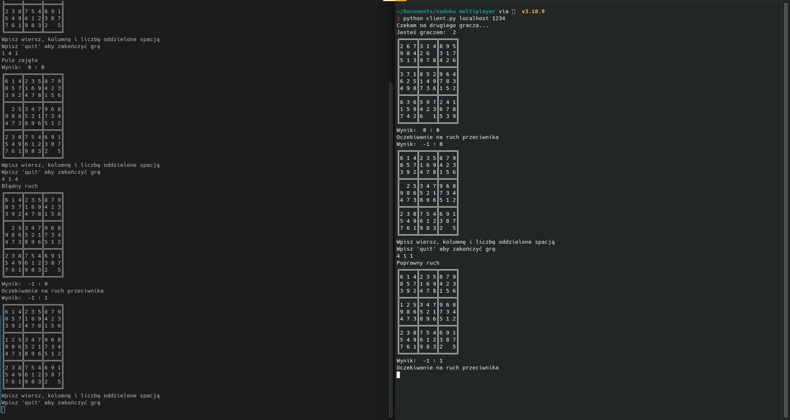

[![Contributors][contributors-shield]][contributors-url]
[![Forks][forks-shield]][forks-url]
[![Stargazers][stars-shield]][stars-url]
[![Issues][issues-shield]][issues-url]
[![MIT License][license-shield]][license-url]
[![LinkedIn][linkedin-shield]][linkedin-url]


<!-- PROJECT LOGO -->
<br />
<p align="center">
  <a href="https://github.com/KacperKurz/Sudoku-Multiplayer">
  </a>

  <h3 align="center">Sudoku Multiplayer</h3>

  <p align="center">
    A multiplayer sudoku game made in python using datagram sockets for my course.
    <br />
    <a href="https://github.com/KacperKurz/Sudoku-Multiplayer"><strong>Explore the docs »</strong></a>
    <br />
    <br />
    <a href="https://github.com/KacperKurz/Sudoku-Multiplayer/issues">Report Bug</a>
    ·
    <a href="https://github.com/KacperKurz/Sudoku-Multiplayer/issues">Request Feature</a>
  </p>


<!-- TABLE OF CONTENTS -->
<details open="open">
  <summary><h2 style="display: inline-block">Table of Contents</h2></summary>
  <ol>
    <li>
      <a href="#about-the-project">About The Project</a>
      <ul>
        <li><a href="#built-with">Built With</a></li>
      </ul>
    </li>
    <li>
      <a href="#getting-started">Getting Started</a>
      <ul>
        <li><a href="#prerequisites">Prerequisites</a></li>
        <li><a href="#installation">Installation</a></li>
      </ul>
    </li>
    <li><a href="#usage">Usage</a></li>
    <li><a href="#contact">Contact</a></li>
  </ol>
</details>


<!-- ABOUT THE PROJECT -->
## About The Project




### Built With

* [Python](https://www.python.org/)


<!-- GETTING STARTED -->
## Getting Started

To get a local copy up and running follow these simple steps.

### Prerequisites

* Python

### Installation

1. Clone the repo
   ```sh
   git clone https://github.com/KacperKurz/Sudoku-Multiplayer.git
   ```
2. Run the server
   ```sh
   python server.py *ip* *port*
   ```
3. Run the clients
   ```sh
    python client.py *ip* *port*
    ```

<!-- USAGE EXAMPLES -->
## Usage

In order to play you need to start the server and have 2 clients connected. Then the game starts and chooses who starts. The game is played by entering the coordinates of the field you want to change and the number you want to put there. The game ends when the board is full or when one of the players disconnects.


<!-- CONTACT -->
## Contact

Kacper Kurz - kacperkurz@protonmail.com

Project Link: [https://github.com/KacperKurz/Sudoku-Multiplayer](https://github.com/KacperKurz/Sudoku-Multiplayer)


<!-- MARKDOWN LINKS & IMAGES -->
<!-- https://www.markdownguide.org/basic-syntax/#reference-style-links -->
[contributors-shield]: https://img.shields.io/github/contributors/KacperKurz/Sudoku-Multiplayer.svg?style=for-the-badge
[contributors-url]: https://github.com/KacperKurz/Sudoku-Multiplayer/graphs/contributors
[forks-shield]: https://img.shields.io/github/forks/KacperKurz/Sudoku-Multiplayer.svg?style=for-the-badge
[forks-url]: https://github.com/KacperKurz/Sudoku-Multiplayer/network/members
[stars-shield]: https://img.shields.io/github/stars/KacperKurz/Sudoku-Multiplayer.svg?style=for-the-badge
[stars-url]: https://github.com/KacperKurz/Sudoku-Multiplayer/stargazers
[issues-shield]: https://img.shields.io/github/issues/KacperKurz/Sudoku-Multiplayer.svg?style=for-the-badge
[issues-url]: https://github.com/KacperKurz/Sudoku-Multiplayer/issues
[license-shield]: https://img.shields.io/github/license/KacperKurz/Sudoku-Multiplayer.svg?style=for-the-badge
[license-url]: https://github.com/KacperKurz/Sudoku-Multiplayer/blob/master/LICENSE.txt
[linkedin-shield]: https://img.shields.io/badge/-LinkedIn-black.svg?style=for-the-badge&logo=linkedin&colorB=555
[linkedin-url]: https://linkedin.com/in/kacper-kurz-175707199/